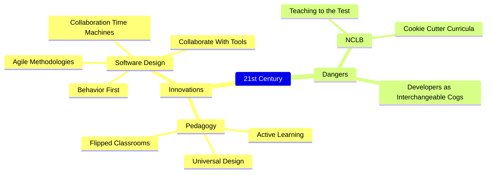

# Active learning with modern tools

## Introduction

This essay is an attempt at cross-polination from the world of modern software development to the world of K-12 education. 
Humanity has been seriously thinking about computation for at least a century (Lovelace, Wittgenstein, Gödel, Turing, von Neumann, Curry, Kay, and countless others), but the explosion over the past twenty years in the power and usability of the core tools used by software developers is quite extraordinary.
