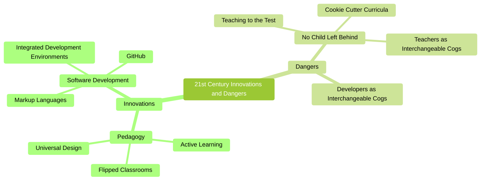
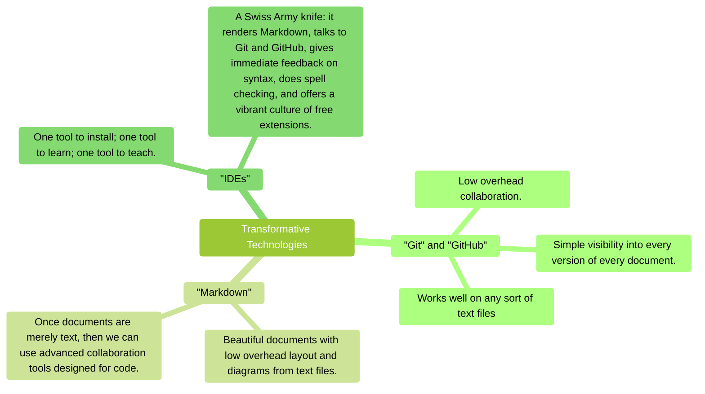
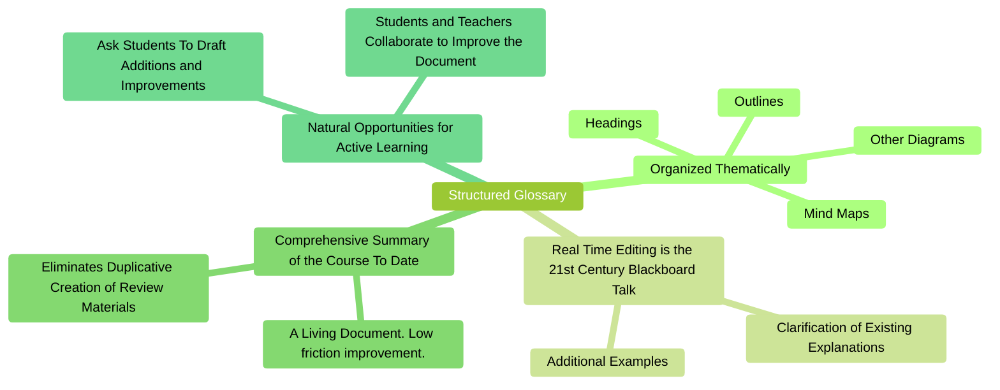
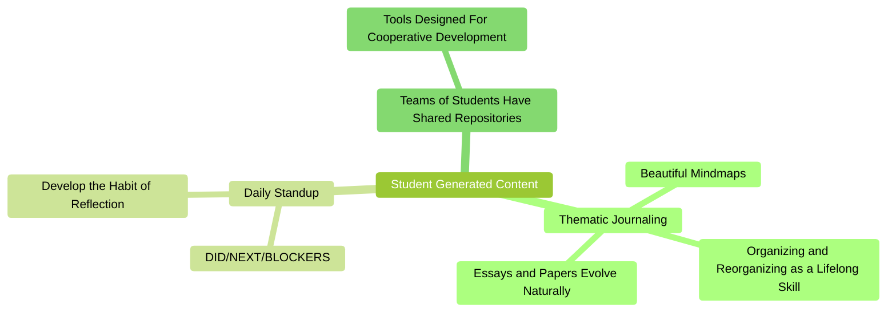

# Active learning with modern tools

## Introduction

This essay is an attempt at cross-polination from the world of modern software development to the world of K-12 education.
Humanity has been seriously thinking about computation for at least a century, but the explosion over the past twenty years in the power and usability of the core tools used by software developers is quite extraordinary.
I believe that some of these tools are now sufficiently mature and useful that they deserve to escape the narrow confines of IT and enter widespread use in education.
These are transformative technologies and cannot just be dropped into existing educational structures, but I believe that they are consistent with and amplify the best currents in modern educational practices.

## Transformative technologies

For reference, these are the technologies which I'm hoping will find truly widespread adoption. Their power won't be immediately apparent until we see some examples how they can be used together, but they should be at least introduced: 

* Git
  * Created in 2005 by the creator of Linux, Linus Torvalds, to serve the thousands of collaborators who have contributed tens of millions of lines of code to Linux.
  * It keeps track on your computer of every version of every file it stores.
  * It was originally used for computer code, but it works equally well for any form of plain text.
  * The history of this essay is stored in Git ... you can see how it evolved over time.
* GitHub
  * A central Git repository allowing users to synchronize their repositories with each other.
  * Provides an easy-to-use web interface allowing people to view the contents of repositories without installing anything on their local machines.
  * This essay is available at <https://github.com/marshallflax/vision/blob/main/README.md>
* MarkDown
  * Simple punctuation which adds structure to a text document.
    * Lines which begin with `#`, `##`, `###`, `####` become headings in a table-of-contents.
    * Lines which begin with `*` are bullet points; indentation lets you create nested lists.
    * Quotes are preceeded with `>`.
  * No need to use the mouse and menus to italicize a word ... just surround with `_`.
  * Because rich documents are now just text, we can use modern text-based collaboration tools.
  * This essay is written in MarkDown. The raw MarkDown is available on the right-hand side of <https://github.com/marshallflax/vision/blame/main/README.md>.
* Integrated Development Environments
  * A single tool designed by programmers to make programmer's life easier and more efficient.
  * A text editor which is aware of the structure of the files it edits.
  * Modern programming is a *collaboration* between the developer and their IDE ... it is aware of the syntactic requirements of programming languages and gives immediately grammatical feedback.
  * The VSCode IDE is free, supported by Microsoft, widely available, and is probably used by a majority of developers nowadays.
  * This essay was written inside a normal VSCode window.

## Example: The Structured Glossary

As an example of the power of the above tools, let me create an imaginary class and show how they can combine to allow a restructuring of an ordinary class.

* The class begins with the teacher sharing their laptop screen.  On the left side of the screen is a text document, in the above Markdown format.  On the right side of the screen is the formatted version, with beautiful layout and colorful diagrams.
* Students can also have the document on their laptops if they wish, or they can follow from the teacher's shared screen.
  (Students with visual impairments will probably choose to rely on their own computers, as it can be customized with appropriate color palettes, magnification, screen readers, or braille displays.)
* The document they're all viewing is a structured glossary for the current course.
  It is always a work-in-progress.
  As new terminology and concepts are added, they are added to the document.
  When the class revisits topics, additional explanations and clarifications are added.
  Colorful mindmaps are scattered throughout.
  This document is organized thematically, not chronologically.
  The automatic table-of-contents feature is quite useful here.
* The teacher has a practice of starting the day with a review of all changes to this document since the prior class day.
  With a single right-click, the teacher can see all of the recent changes, organized into logical chunks.
  The teacher clicks on any one of them, and the screen highlights all of the changes, with deleted lines in red and new lines in green.
  Some of the additions are familiar to the students from the prior day, but the teacher may also use this as an opportunity to introduce new material.
* (In the higher grades, some of these chunks were created by the teacher, but many of them were proposed by students and then accepted (after review) by the teacher.)
* As yesterday's changes are reviewed, the teacher finds that there other concepts for which the students need additional explanations.
  The teacher navigates to that part of the structured glossary and the editor becomes a 21st-century blackboard as the teacher adds some nested bullet points with additional examples and glosses.
  Simple diagrams can be added just as easily as plain text.
  At the end of the mini-lesson, the improvements are described with a short phrase and pushed to GitHub with two or three clicks.
  With another click or two, students can update their laptops, or they can wait until convenient.
  These changes will then of course be available for review the next class day.
* The formatted version of the Structured Glossary is always available at the GitHub website, and is available without anything except a web browser.

Let's stop here for a moment.
What are the advantages of this approach?

* Students no longer refer to out-of-date or only-partially-applicable powerpoints.
* No more questions of "what's on the final".
* No more duplicative work creating review materials.
* When a student has a question on a previously-covered topic, the first question can simply be: "did you check the structured glossary"?
  But when they have, then we have *two* followups: (1) a mini-lesson for the student, and (2) clarifications and/or additions to the glossary.
  (As a side-note, I don't know of a purer application of active learning than to have the student themself draft the improvements.)
* A live master-class by the teacher in how to organize (and periodically reorganize) large quantities of information.
* Repeated modelling by the teacher of incremental improvement towards excellence.

## Example: Journaling

Teacher-generated content is important, but active learning occurs when students generate their own content.
A student can have a single repository containing many files. One file might be a thematic summary of the course, mirroring the instructor's but in their own words.
Another file might be a daily diary in the standard form of a Scrum Methodology Standup Meeting: what they did yesterday, what they'll be doing next, and whether they have any blockers.
Of course, the real purpose is to teach the student continual self-improvement.
But pushing this repo to GitHub has the advantage that data will never be lost, and also gives visibility to the teacher as to student progress.

Shield: [![CC BY-SA 4.0][cc-by-sa-shield]][cc-by-sa]

This work is licensed under a
[Creative Commons Attribution-ShareAlike 4.0 International License][cc-by-sa].

[![CC BY-SA 4.0][cc-by-sa-image]][cc-by-sa]

[cc-by-sa]: http://creativecommons.org/licenses/by-sa/4.0/
[cc-by-sa-image]: https://licensebuttons.net/l/by-sa/4.0/88x31.png
[cc-by-sa-shield]: https://img.shields.io/badge/License-CC%20BY--SA%204.0-lightgrey.svg