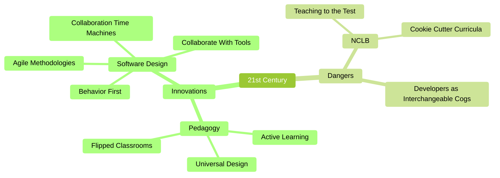
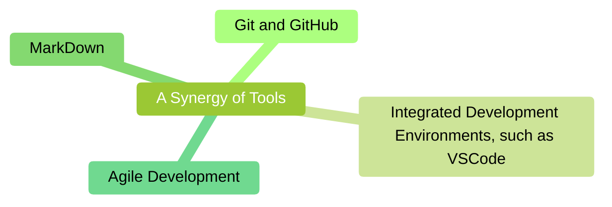

# Active learning with modern tools



## Introduction

This essay is an attempt at cross-polination from the world of modern software development to the world of K-12 education.
Humanity has been seriously thinking about computation for at least a century, but the explosion over the past twenty years in the power and usability of the core tools used by software developers is quite extraordinary.
I believe it is time for some of these tools to escape the narrow confines of IT and enter widespread use in education.
These are transformative technologies and cannot just be forklifted into existing educational structures, but I believe that they are consistent with and amplify the best currents in modern educational practices.

## Mutually-reinforcing tools



As with describing any highly-syngergetic system, it is difficult to know where to begin. So let me start in the middle, and give an example of how these tools can be used in an educational setting. Feel free to read only the top-level bullets and ignore the additional glosses.

* Today's class begins with the teacher sharing VSCode on their laptop.
  * VSCode is totally free software created by Microsoft but available for Macs, Windows, Linux, and even ChromeOS.
  * VSCode is now used by a majority of software developers, and its popularity continues to grow.
  * VSCode is highly extensible and has a rich ecosystem of free extensions.
* On the screen is a text document, which looks like plain text, with three notable exceptions.
  (1) Some lines start with a number of `#` symbols ... these automatically go to a Table of Contents.
  (2) Some lines start with some spaces and then a `*` ... these of course define an outline structure.
  (3) Some blocks of text are surrounded by ` ```mermaid ` ... these use simple text define diagrams.  
  * If you are viewing this essay on GitHub, just press the "Raw" button to see exactly what we're describing here.
* Students also are running VSCode on their laptops.
  They also have a copy of the same document, but it doesn't reflect the additions the teacher made last night.
  But with one or two clicks, their screens update to the current version.
  Or they can choose to just watch the instructor's screenshare.
  * Students with visual impairments will probably choose to rely on their own VSCode, as it can be customized with appropriate color palettes, magnification, screen readers, or braille displays.
* The document they're all viewing is a structured glossary for the current course.
  It is always a work-in-progress.
  As new terminology and concepts are added, they are added to the document.
  When the class revisits topics, additional explanations and clarifications are added.
  Colorful mindmaps are scattered throughout.
  This document is organized thematically, not chronologically.
  The automatic table-of-contents feature is quite useful here.
* The teacher has a practice of starting the day with a review of all changes to this document since the prior class day.
  With a single right-click, the teacher can see all of the recent changes, organized into logical chunks.
  The teacher clicks on any one of them, and the screen highlights all of the changes, with deleted lines in red and new lines in green.
  Some of the additions are familiar to the students from the prior day, but the teacher may also use this as an opportunity to introduce new material.
  * In the higher grades, some of these chunks were created by the teacher, but many of them were proposed by students and then accepted (after review) by the teacher.
* As yesterday's changes are reviewed, the teacher finds that there other concepts for which the students need additional explanations.
  The teacher navigates to that part of the structured glossary and VSCode becomes a 21st-century blackboard as the teacher adds some nested bullet points with additional examples and glosses.
  Simple diagrams can be added just as easily as plain text.
  At the end of the mini-lesson, the improvements are described with a short phrase and pushed to GitHub with two or three clicks.
  With another click or two, students can update their laptops, or they can wait until convenient.
  These changes will then of course be available for review the next class day.

Let's stop here for a moment.  What do we have here?

* Students no longer refer to out-of-date or only-partially-applicable powerpoints.
* No more questions of "what's on the final".
* No more duplicative work creating review materials.
* When a student has a question on a previously-covered topic, the first question can simply be: "did you check the structured glossary"?
  But when they have, then we have *two* followups: (1) a mini-lesson for the student, and (2) clarifications and/or additions to the glossary.
  (As a side-note, I don't know of a purer application of active learning than to have the student themself draft the improvements.)
* A live master-class by the teacher in how to organize (and periodically reorganize) large quantities of information.
* Repeated modelling by the teacher of incremental improvement towards excellence.
