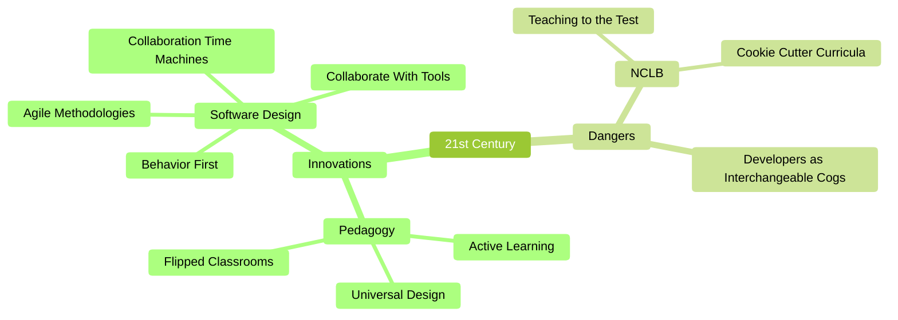
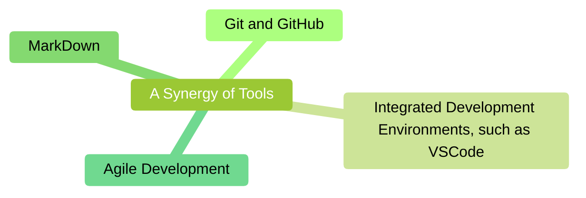

# Active learning with modern tools

## Introduction

This essay is an attempt at cross-polination from the world of modern software development to the world of K-12 education.
Humanity has been seriously thinking about computation for at least a century, but the explosion over the past twenty years in the power and usability of the core tools used by software developers is quite extraordinary.
I believe it is time for some of these tools to escape the narrow confines of IT and enter widespread use in education.
These are transformative technologies and cannot just be forklifted into existing educational structures, but I believe that they are consistent with and amplify the best currents in modern educational practices.

## Mutually-reinforcing tools

As with describing any highly-syngergetic system, it is difficult to know where to begin. So let me start in the middle, and give an example of how these tools can be used in an educational setting.
