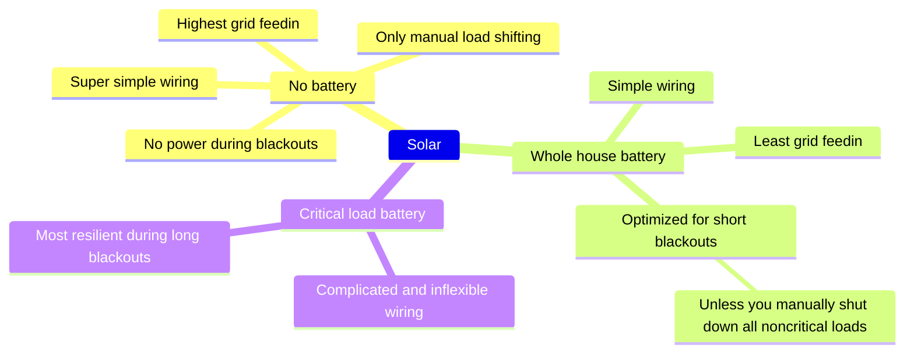
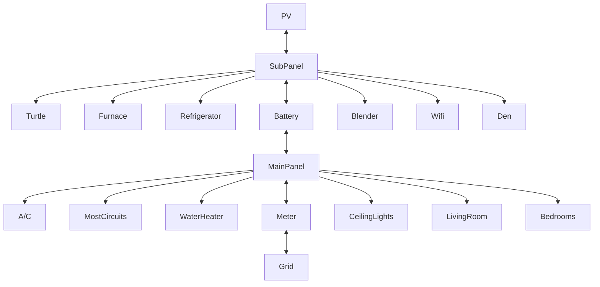

# Solar

```mermaid
mindmap
 Solar
  No battery
   Super simple wiring
   No power during blackouts
   Only manual load shifting
   Highest grid feedin
  Whole house battery
   Simple wiring
   Least grid feedin
   Optimized for short blackouts
    Unless you manually shut down all noncritical loads
  Critical load battery
   Complicated and inflexible wiring
   Most resilient during long blackouts
```

```mermaid
graph TB;
 PV <--> SubPanel
 SubPanel --> Turtle
 SubPanel --> Furnace
 SubPanel --> Refrigerator
 SubPanel <--> Battery
 SubPanel --> Blender
 SubPanel --> Wifi
 SubPanel --> Den
 Battery <--> MainPanel
 MainPanel --> A/C
 MainPanel --> MostCircuits
 MainPanel --> WaterHeater
 MainPanel <--> Meter
 MainPanel --> CeilingLights
 MainPanel --> LivingRoom
 MainPanel --> Bedrooms
 Meter <--> Grid
```

