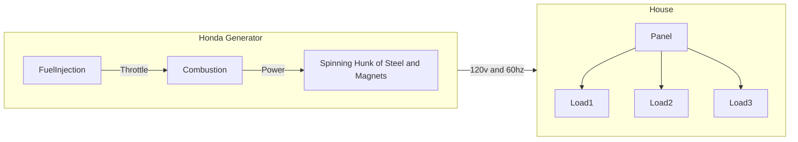
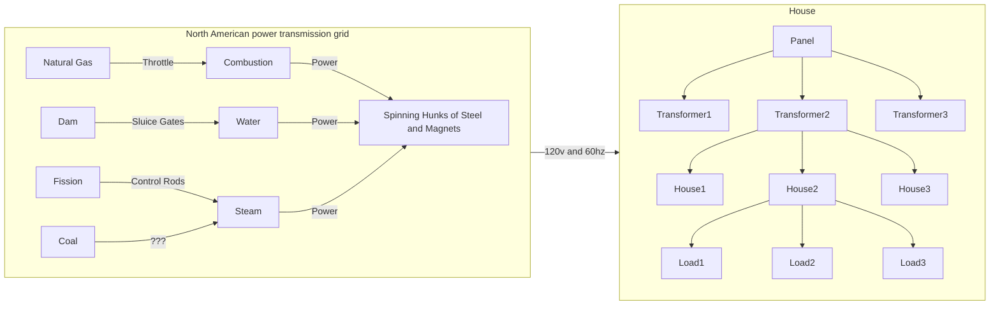
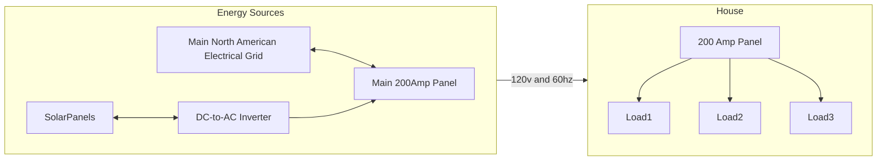
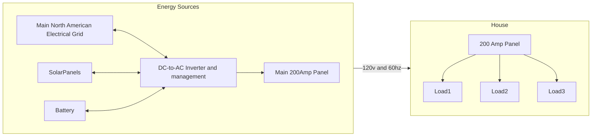
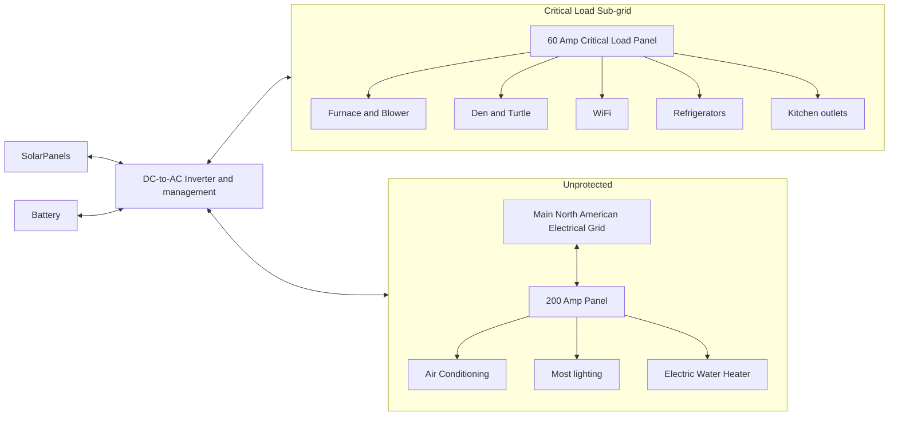
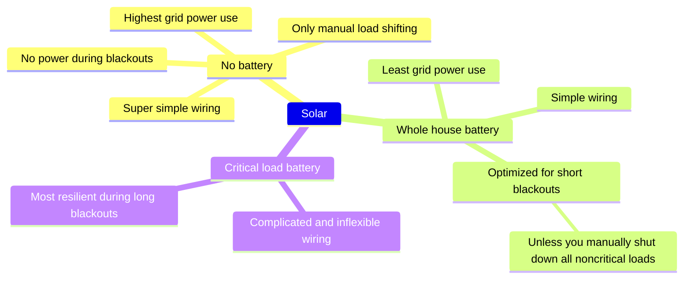

# Residential Solar 101

---

## Nano Grid

- If the load increases (or decreases), the spinning hunk of metal will encounter more (or less) magnetic resistance and start to slow down. The generator will notice this and increase (or decrease) the throttle to restore the 60hz frequency.
- This balance needs to be maintained: if the electrical energy created by the generator exceeds the electrical energy used by the loads, then that additional energy will become heat and damage the generator.

---

## Macro Grid

- Exactly the same as the Nano Grid, except that the law of large numbers means that the second-by-second variation of many users tends to cancel each other out.
- A mix of slow-to-adjust (e.g. nuclear), medium-to-adjust (e.g. coal), and  fast-to-adjust (e.g. natural gas or hydro) power sources works well.

---

## Residential Solar (without batteries)

- If the panels create more energy than the house needs, then the additional energy will simply flow onto the main grid.
- The DC-to-AC inverter *must* exactly match the voltage and frequency of the grid -- otherwise the electric fields will cancel each other out and create damaging heat.
- If the grid is down ("blackout") then:
  - No reference frequency and voltage
  - No place for excess energy to go
  - The solar inverter cannot safely function
  - No solar power

---

## Residential Solar (whole-house battery)

<pack scale=0.90>

- In normal operation, the DC-to-AC inverter gets its frequency and voltage from the North American Grid.
  - The battery will charge during the day (and once full, the excess will go back onto the grid).
  - The battery will discharge at night (and once at its minimum value, power will be drawn from the grid).
- During a blackout, the inverter will disconnect from the grid and generate its own frequency and voltage references.
  - The solar panels will continue to operate -- unless the battery is full.
  - If the battery is full, the inverter will stop converting DC-to-AC and the house will run purely off the battery. Once the battery is down to 90% (or whatever), the solar panels will start generating power again.
- If you're away during a summer blackout, your A/C is likely to drain the battery before you return.

</pack>

---

## Residential Solar (subpanel)

<pack scale=1.00>

- In normal operation, priority of solar power use:
  - 1st -- Sub-panel load
  - 2nd -- Recharging battery
  - 3rd -- Unprotected panel load
  - 4th -- Excess to Grid

</pack>

---

